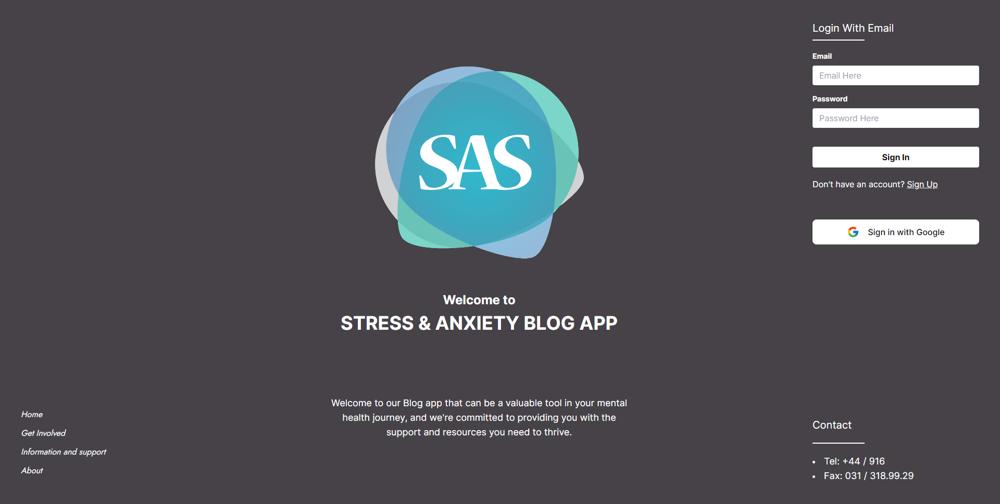
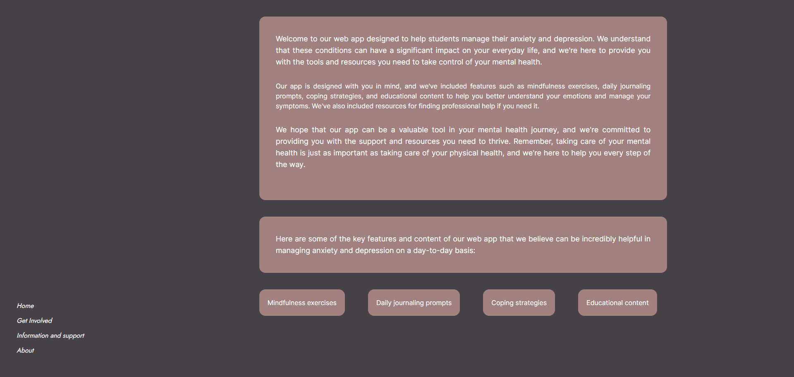
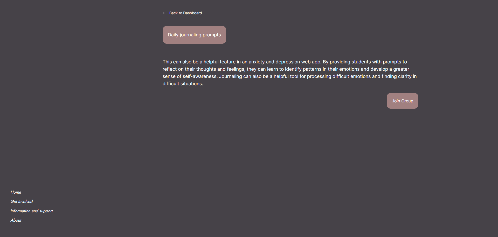

# STRESS AND ANXIETY BLOGS

React STRESS AND ANXIETY BLOGS is a single page application (SPA) built with React.js that supports university students in dealing with stress and anxiety. It provides a platform for users to login, view a dashboard, and create posts to share their experiences and thoughts.

## Methodology

The methodology implemented in this project leverages the following technologies and frameworks:

- React.js: A JavaScript library for building user interfaces.
- ES6: The latest version of ECMAScript, providing new features and syntax for JavaScript.
- Firebase: A cloud-based platform for building web and mobile applications, used here for authentication.
- Tailwind CSS: A utility-first CSS framework for quickly styling components.
- Daisy UI: A plugin for Tailwind CSS that provides a set of additional utility classes.
- React Icons: A collection of icons for React applications.

## Pages

The React Social-n-Blogs application consists of the following three pages:

### 1. Index (Login Page)

The index page serves as the login page, where users can authenticate themselves to access the application.

### 2. Dashboard

The dashboard page provides users with an overview of the platform. It may include features like a news feed, user profile information, and navigation to other sections of the application.

### 3. Post Pages

The post pages allow users to create and view posts shared by others. Users can write about their experiences, thoughts, or any topics related to stress and anxiety in the university context.

## Authentication

Firebase authentication is used in this application to handle user authentication and secure access to the platform.

## Installation

To run the React Social-n-Blogs application locally, follow these steps:

1. Clone the repository:

`git clone https://github.com/marufalaslam/react-social-n-blogs.git`

2. Install the dependencies:

`cd react-social-n-blogs`

`npm install`

3. Start the development server:

`npm start`

The application will be running at `http://localhost:3000`.

## License

This project is licensed under the [MIT License](LICENSE).
